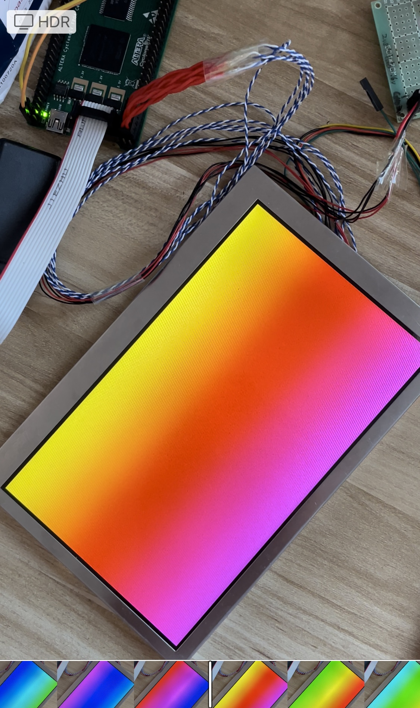

# Driving LVD LCD (AUO G070VW01 V0) using FPGA

This project is driving LCD(AUO G070VW01 V0) using Altera Cyclone IV EP4CE10F17C8N FPGA via LVDS interface.

Author: jlywxy (jlywxy@outlook.com)<br>
Document Version: 2.0r1
- --

## Overview of the LCD Interface 

### 1. Display Interface

The display and control interface satisfied with JEIDA LVDS format.

| Signal Electrical-Level | Speed | Signal Wires | Power Supply
|-|-|-|-|
| 1.2v-LVDS | 33.3*7 MHz | LVDS(3/4 lanes(2 clk, 6/8 data)) | 3.3v |


* This display will not use HSYNC and VSYNC signal (DE mode only), and with selectable 6/8 bit color depth.

### 2. Backlight Interface

This LCD requires 12v single power with max 240mA current with internal backlight driver. 

### 3. Connector

The part number of Mating connector is below:

|CN1(LVDS, VDD, control)          | Pins |
|-|-|
| STM P24013P20/Hirose DF19-20S-1C | 20pins with 1.27mm interval |

| CN2(Backlight and Dimming) | Pins |
|-|-|
| Entery H208K-P04N-02B | 4pins with 1.27mm interval |

- --

## Intention of the project
1. Showing waterflow color gradient animation.<br>

- --

## Display Workflow(Steps to light up display)

0. Backlight power on.
1. LCD VDD on, Reset.
3. Start LVDS transmission.

- --

## FPGA configurations for Display Workflow

1. Use pins with LVDS electrical level. It's better to use 2.5V Bank VCCIO for LVDS output pin.
2. USE ALTLVDS_TX IP to convert parallel data to serial.
Set serialization factor to 7, transmitting speed to 7 times of CLK, output clock duty cycle to 57.
It is recommended to use a additional data lane as CLK output(1100011), because clock phase setting of this IP not works and cause LVDS output cannot satisfy with JEIDA format.
- --

## Connection and Transmission Concepts 

1. Since LVDS is differential, it's better to use twisted-pairs of long transmission line. If you are drawing PCB, make sure lines are close enough, have continuous GND layer wrapping, have same length and satisfy LVDS 100 Ohm impedance (calculate wire width and interval using Polar SI9000 or compatible).
2. Avoid using separate pin connector. Use continus pin header and connector for LVDS lines. When line need to be lengthening, soldering line contact is needed.
3. Although LVDS theoretical electric level of LCD is almost limited, it is tested to use 3.3v Bank VCCIO (Altera LVDS_E_3R) for LCD LVDS transmission even without indicated "E_3R"(external 3 resistors).
4. LVDS transmissions on Altera FPGAs are splited to 2 types: True LVDS ans Emulated LVDS, which True LVDS use hardware LVDS transmitter and Emulated LVDS uses two single-ended pins to emulated differential. The speed of True LVDS could reach up to 840Mbps, which Emulated one reaches max 640Mbps. For Cyclone IV, only 2 IO banks have True LVDS transmitter.
- --

## Misc

### LCD Optical Characteristics


| Pixel-Arrangement | Panel-Type | Color-Depth |
|-|-|-|
| RGB horizontal stripes | TN | 6/8bit, 16.2M |

| Contrast | Color-Chromaticity | Backlight |
|-|-|-|
| 750:1 | 60% NTSC | 400 nits |


### Knowledge Bases of Concepts

1. LVDS

LVDS is a type of differential transmission, which uses 2 wires (Positive line and Negative line) to transmit 1 bit. The electric level in two lines is swinging(±300mV) around a fixed voltage (common voltage, typically 1.2v). When Positive line level is higher than Negative line, the differential line indicate `1`.
The use of differential is intended to reduce EMI and promote transmission speed.

2. JEIDA LVDS format

LVDS data format in LCD is simply packing RGB control/data signal in serial. JEIDA format of LVDS LCD is shown below:
|||||||||
|-|-|-|-|-|-|-|-|
|CLK   | 1 | 1 | 0 | 0 | 0 | 1  | 1 |
|Lane0 | G0 | R5 | R4 | R3 | R2 | R1 | R0 |
|Lane1 | B1 | B0 | G5 | G4 | G3 | G2 | G1 |
|Lane2 | DE | VS | HS | B5 | B4 | B3 | B2 |
|Lane3 |  x | B7 | B6 | G7 | G6 | R7 | R6 |

* Note 1: sequence above is starting right from one LVDS period.
* Note 2: Lane3 is not used when using RGB666)

RGB is a parallel interface, which is known as MIPI DPI specification.

3. MIPI DPI

* The MIPI Alliance defines modern interface of mobile devices like phones, including display, cameras, etc. 
* MIPI-DPI is one of the MIPI display interface series, which is well known as RGB/Parallel/LTDC interface. This interface splits control lines(HSYNC/VSYNC/DE) with data lines(RGB parallel lines). Since it uses single-ended signals(compared to MIPI-DSI), the max speed(clock speed) could be limited, but it can transfer full pixel data in one clock period(compared to serial interfaces). The color depth is configurable as RGB565/RGB666/RGB888 and more, which could also be 'hacked' to leave out some pins or branch some lines(when downsampling color depth, throw away certain LSB; when upsampling, branch certain MSB to LSB or connect certain LSB to GND).
```
RGB888 (typical format of 16.7M color display)
-------------------------------------------------
       RRRRRRRR GGGGGGGG BBBBBBBB (3 bytes)

RGB666 (typical format of 262k color display, and 16.2M color TN panels with FRC)
-------------------------------------------------
             RR RRRRGGGG GGBBBBBB (18 bits)

RGB565
-------------------------------------------------
                RRRRRGGG GGGBBBBB (2 bytes)

RGB101010 (not available in most of the displays, typical format of 1.07B color screen)
-------------------------------------------------
RRRRRR RRRRGGGG GGGGGGBB BBBBBBBB (30 bits)
```


### Document Patch and Errata

* Fixed document format problem: charts.<br>

patch above: jlywxy@2023.2.8<br>
