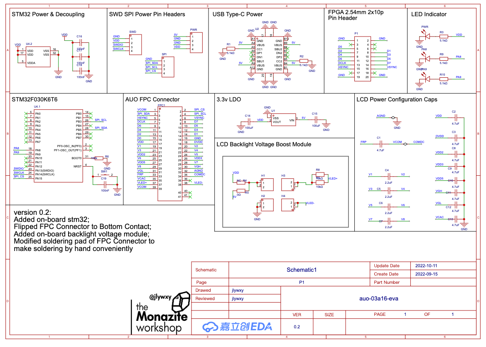
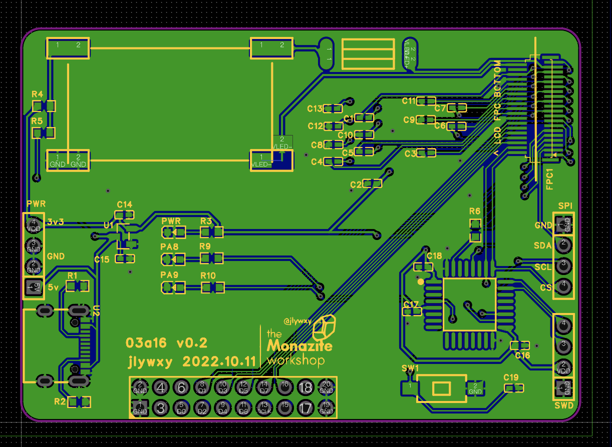

# Driving "UPS05x"(parallel RGB) LCD(AUO A030DW01/02) using FPGA

This project is driving LCD(AUO A030DW01-03a16 and A030DW02-03a33) using Altera Cyclone IV EP4CE10F17C8N FPGA.<br>
The two types of LCD will be called as `A030DW0x` in the project.<br>


Author: jlywxy (jlywxy@outlook.com)<br>
Document Version: 1.1r1

- --

## Intention of the project

1. The test method of availability in this project is to show color gradient.<br>

<br>

2. A PCB is made to engage the connection to FPGA, including power management and capacitors for LCD configuration.<br>(For schematic pdf, look into directory <a href="pcb">pcb</a>)<br>

<br>

- --

## Overview of the LCD Module

### 1. Display Interface

A030DW01 and A030DW02 shares the same info of specification document.<br>
This LCM supports different interfaces: UPS051/052(8-bit RGB), CCIR656, YUV720/640.

|Signal Electrical-Level       | Speed         | Signal Wires| Power Supply
|-----------------------|----------------|-----------|-|
|3.3v-TTL | 24.535/27 MHz | SPI(SCL, SDA), RGB(HSYNC, VSYNC, 8 data)|3.3v


### 2. Backlight Interface

This LCM requires 9.6v single power with 20mA current with selectable internal backlight driver.

### 3. Connector

The part number of Mating connector is not shown in specification sheet. This project is using FH26W of Hirose connector, which has 39pin with crossed 0.3mm interval and bottom contact surface.
```
-----------------
1 3 5 7 9       insert direction: ^ (up)
❚|❚|❚|❚|❚ ...   each row has 0.6mm interval
|❚|❚|❚|❚ ...
 2 4 6 8 
-----------------
```
- --


## PCB Design Suggestion for Testing

1. It's more convenient to modify FPC connector soldering pads for hand-soldering. Too short or thin pads will cause soldering iron break the connector or unable to solder on.
2. Using cheap CPLD to generate signal is viable, which is not performed in this project.

- --

## Display Workflow(Steps to light up display)

0. Backlight power on.
1. LCM VDD on, Reset.
2. Initialize LCM with commands.
3. Start data transmission.

* Caution: The SPI initialization will only take effect after HSYNC signal starts.
* To make sure initializaiton works, read registers after wrote them by Half-Duplex SPI transmission.
* For more init commands, refer to AUO A030DW01 V0 Specification sheet.

- --
## Misc

### LCD Module Optical Characteristics


|Pixel-Arrangement  | Panel-Type | Color-Depth
|-------------------|------------|------------------
RGB delta          | TN         | 8-bit (16.2M)


|Contrast | Color-Chromaticity            | Backlight
|----------|-------------------------------|--------
|300:1    | approx. 60% NTSC (not provided in spec) | 500 nits


### Knowledge Bases of Concepts
1. AUO UPS051

AUO UPS051 is a type of RGB interface, but with 8-bit data lines and 3 times of PCLK freq. This is a non-interlaced LCD parallel interface, but lines indexed at odd number receives 1 color data ahead of even lines, because his screen has RGB-Delta pixel arrangement, therefore RGB data output at odd lines from FPGA/CPLD should shift 8 bits.
```
line 1,3,5,...  R G B R G B R G B R G B ...
line 2,4,6,...  G B R G B R G B R G B R ...
```
RGB data of odd lines should be right after even lines(generate one frame from lines 0,1,2,...to VACT), rather than generating one frame of odd lines then another frame of even lines described in spec sheet.

2. MIPI DPI

* The MIPI Alliance defines modern interface of mobile devices like phones, including display, cameras, etc. 
* MIPI-DPI is one of the MIPI display interface series, which is well known as RGB/Parallel/LTDC interface. This interface splits control lines(HSYNC/VSYNC/DE) with data lines(RGB parallel lines). Since it uses single-ended signals(compared to MIPI-DSI), the max speed(clock speed) could be limited, but it can transfer full pixel data in one clock period(compared to serial interfaces). The color depth is configurable as RGB565/RGB666/RGB888 and more, which could also be 'hacked' to leave out some pins or branch some lines(when downsampling color depth, throw away certain LSB; when upsampling, branch certain MSB to LSB or connect certain LSB to GND).
```
RGB888 (typical format of 16.7M color display)
-------------------------------------------------
       RRRRRRRR GGGGGGGG BBBBBBBB (3 bytes)

RGB666 (typical format of 262k color display, and 16.2M color TN panels with FRC)
-------------------------------------------------
             RR RRRRGGGG GGBBBBBB (18 bits)

RGB565
-------------------------------------------------
                RRRRRGGG GGGBBBBB (2 bytes)

RGB101010 (not available in most of the displays, typical format of 1.07B color screen)
-------------------------------------------------
RRRRRR RRRRGGGG GGGGGGBB BBBBBBBB (30 bits)
```

4. LCM

* A abbreviation of Liquid Crystal Module, which includes LCD glass panel and backlight LEDs.

### Document Patch and Errata

* Fixed document format problem: charts.<br>

patch above: jlywxy@2023.2.8<br>
